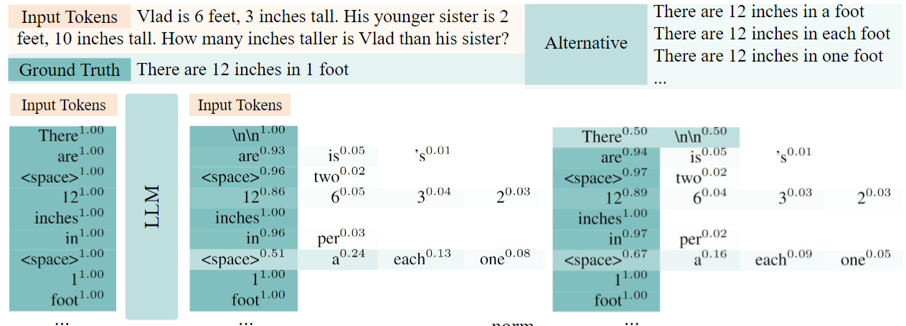
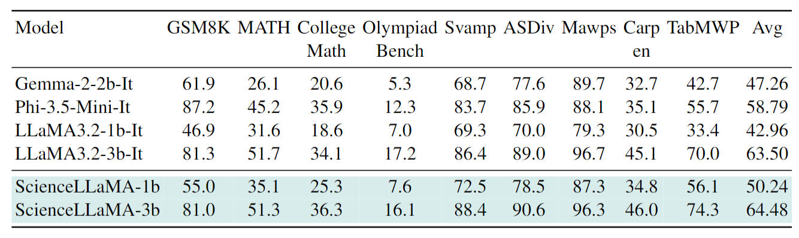

# Logits-Based Finetuning
<p align="center">
• 🤗 <a href="https://huggingface.co/datasets/JingyaoLi/Science-Logits-1.2M" target="_blank">Data </a> 
• 🤗 <a href="https://huggingface.co/JingyaoLi/ScienceLLaMA-3b" target="_blank">ScienceLLaMA-3B </a> 
• 🤗 <a href="https://huggingface.co/JingyaoLi/ScienceLLaMA-1b" target="_blank">ScienceLLaMA-1B </a> 
• 🐱 <a href="Logits-based Finetuning" target="_blank">Code</a> 
• 📃 Paper (TO be released) <br>
</p>

**Logits-Based Finetuning** integrates the strengths of supervised learning and knowledge distillation by combining teacher logits with ground truth labels, preserving both correctness and linguistic diversity. This ensures more reliable and effective training.  

<div style="text-align: center;">
    
</div>

## Performance
<div style="text-align: center;">
    
</div>

## Train
- **Data**: [huggingface](https://huggingface.co/datasets/JingyaoLi/Science-Logits-1.2M)
- **Readme**: [Installation Guide](https://github.com/hiyouga/LLaMA-Factory?tab=readme-ov-file#installation)
- **Installation**:
```bash
git clone --depth 1 https://github.com/hiyouga/LLaMA-Factory.git
cd LLaMA-Factory
pip install -e ".[torch,metrics]"
```
- **Run**
```bash
# 1b
llamafactory-cli train llamafactory/scripts/llama3.2_1b_instruct_pkl_1300k_e1_warmup0.1_cosinelr1e-6_seed42_maxl2048_a0.9_t1.0_logp5_freqt_0_b1.0_r1.0.yaml
# 3b
llamafactory-cli train llamafactory/scripts/llama3.2_3b_instruct_pkl_1300k_e1_warmup0.1_cosinelr1e-6_seed42_maxl2048_a0.9_t1.0_logp5_freqt_0_b1.0_r1.0.yaml
```

- **Hyperparatemers**

| Parameter | Type | Default | Description |
|-----------|------|---------|-------------|
| `use_distill` | `bool` | `False` | Whether to enable distillation. |
| `distill_alpha` | `float` | `0.9` | Balance weight for the distillation loss. |
| `distill_t` | `float` | `1.0` | Temperature for the distillation loss. |
| `distill_gamma` | `float` | `1.0` | Balance weight for teacher model logits. |

## Evaluation

- **Installation**
```bash
cd evaluation/latex2sympy
pip install -e .
cd ..
pip install -r requirements.txt 
pip install vllm==0.5.1 --no-build-isolation
pip install transformers==4.42.3
```

- **Run**
```bash
bash evaluation/sh/eval.sh "qwen25-math-cot" $MODEL_NAME_OR_PATH
```